# Data Engineering Workflow Platform

> Open Source Data Engineering Platform สำหรับสร้างและจัดการ Data Pipeline ตั้งแต่ Data Source → Data Lake → Transformation → Data Quality → Data Warehouse → Analytics → AI

---

# 1. Project Overview

**Data Engineering Workflow Platform (DEWP)** เป็นแพลตฟอร์มสำหรับสร้าง Data Engineering Workflow แบบครบวงจร โดยเน้นให้สามารถ

* Ingest ข้อมูล
* Transform ข้อมูล
* Validate ข้อมูล
* Orchestrate Pipeline
* Store ข้อมูล
* Monitor Pipeline
* Track Data Lineage
* ส่งข้อมูลต่อให้ BI, ML และ AI

แนวคิดหลัก:

```text
DATA
 ↓
PIPELINE
 ↓
QUALITY
 ↓
WAREHOUSE
 ↓
ANALYTICS
 ↓
AI
```

---

# 2. Quick Start

## 2.1 Requirements

ติดตั้งเครื่องมือพื้นฐาน:

```bash
brew install git python uv
brew install --cask docker
```

ตรวจสอบ:

```bash
git --version
python3 --version
uv --version
docker --version
docker compose version
```

---

# 3. Create Project

สร้าง Project:

```bash
mkdir data-engineering-workflow
cd data-engineering-workflow
```

สร้าง Python Environment:

```bash
uv venv --python 3.13
source .venv/bin/activate
```

ติดตั้ง Python Packages:

```bash
uv pip install \
    pandas \
    polars \
    sqlalchemy \
    psycopg2-binary \
    requests \
    python-dotenv \
    pydantic \
    dbt-postgres
```

---

# 4. Project Structure

สร้างโครงสร้างเริ่มต้น:

```bash
mkdir -p \
dags \
ingestion \
transformation \
quality \
warehouse \
dbt/models/staging \
dbt/models/intermediate \
dbt/models/marts \
data/bronze \
data/silver \
data/gold \
tests \
scripts \
notebooks \
docs \
monitoring
```

โครงสร้าง:

```text
data-engineering-workflow/
│
├── dags/
├── ingestion/
├── transformation/
├── quality/
├── warehouse/
│
├── dbt/
│   └── models/
│       ├── staging/
│       ├── intermediate/
│       └── marts/
│
├── data/
│   ├── bronze/
│   ├── silver/
│   └── gold/
│
├── tests/
├── scripts/
├── notebooks/
├── docs/
├── monitoring/
│
├── docker-compose.yml
├── requirements.txt
├── .env
├── .gitignore
└── README.md
```

---

# 5. Start Infrastructure

Development Infrastructure ใช้:

```text
Docker
│
├── PostgreSQL
├── MinIO
└── Airflow
```

เริ่มระบบ:

```bash
docker compose up -d
```

ตรวจสอบ:

```bash
docker compose ps
```

หยุดระบบ:

```bash
docker compose down
```

---

# 6. First Pipeline

Pipeline ตัวแรกใช้ Sales Dataset:

```text
CSV
 ↓
Extract
 ↓
Validate
 ↓
Bronze
 ↓
Transform
 ↓
Silver
 ↓
Data Quality
 ↓
Gold
 ↓
PostgreSQL
```

---

# 7. Create Sample Data

สร้างไฟล์:

```text
data/bronze/sales.csv
```

ข้อมูลตัวอย่าง:

```csv
transaction_id,transaction_date,customer_id,product_id,quantity,unit_price
TX001,2026-09-01,C001,P001,2,100.00
TX002,2026-09-01,C002,P002,1,250.00
TX003,2026-09-02,C001,P003,3,150.00
TX004,2026-09-02,C003,P001,5,100.00
TX005,2026-09-03,C004,P002,2,250.00
TX006,2026-09-03,C002,P003,1,150.00
```

---

# 8. Run Transformation

ตัวอย่าง Python:

```bash
python transformation/sales.py
```

ผลลัพธ์:

```text
data/
│
├── bronze/
│   └── sales.csv
│
├── silver/
│   └── sales_clean.csv
│
└── gold/
    └── sales_daily.csv
```

---

# 9. Verify the Result

ตรวจสอบข้อมูล:

```bash
cat data/silver/sales_clean.csv
```

ตรวจสอบ Gold:

```bash
cat data/gold/sales_daily.csv
```

ตัวอย่างผลลัพธ์:

```text
transaction_date,transaction_count,units_sold,revenue

2026-09-01,2,3,450
2026-09-02,2,8,750
2026-09-03,2,3,650
```

---

# 10. Verify PostgreSQL

เข้า PostgreSQL:

```bash
docker exec -it de-postgres \
psql -U dataeng -d datawarehouse
```

ตรวจสอบ Schema:

```sql
\dn
```

ตรวจสอบ Tables:

```sql
\dt raw.*
\dt staging.*
\dt mart.*
```

Query:

```sql
SELECT *
FROM mart.sales_daily;
```

---

# 11. Architecture

ระบบประกอบด้วย:

```text
Data Sources
      ↓
   Ingestion
      ↓
   Data Lake
      ↓
    Bronze
      ↓
Transformation
      ↓
    Silver
      ↓
Data Quality
      ↓
     Gold
      ↓
Data Warehouse
      ↓
BI / Analytics / ML / AI
```

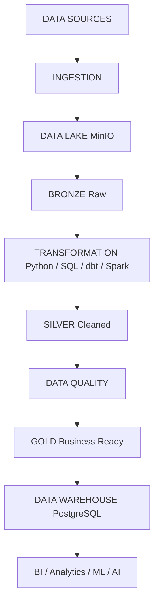

---

# 12. Data Workflow

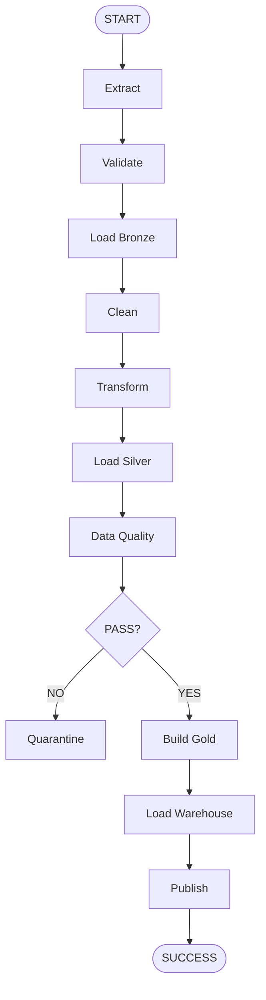

---

# 13. Bronze / Silver / Gold

Project ใช้ **Medallion Architecture**

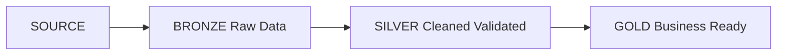

## Bronze

ข้อมูลต้นฉบับ:

```text
Raw
Original
Immutable
Traceable
```

## Silver

ข้อมูลที่ผ่านการ:

```text
Cleaning
Standardization
Deduplication
Validation
```

## Gold

ข้อมูลที่พร้อมสำหรับ:

```text
Analytics
Reporting
BI
ML
AI
```

---

# 14. Data Quality

ตัวอย่าง Quality Rules:

```text
transaction_id
    → UNIQUE

customer_id
    → NOT NULL

quantity
    → > 0

unit_price
    → >= 0

transaction_date
    → VALID DATE
```

Architecture:

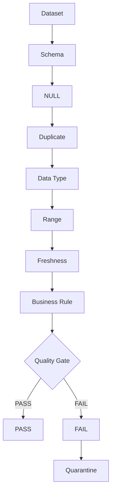

---

# 15. Apache Airflow

Airflow ทำหน้าที่เป็น Workflow Orchestrator

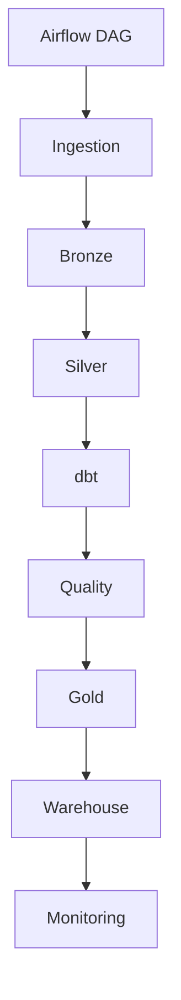

Airflow รับผิดชอบ:

* Scheduling
* Task Dependency
* Retry
* Failure Handling
* Monitoring
* Alerting

---

# 16. dbt

dbt ใช้สำหรับ SQL Transformation

```text
Raw
 ↓
Staging
 ↓
Intermediate
 ↓
Mart
```

โครงสร้าง:

```text
dbt/
│
├── models/
│   ├── staging/
│   │   └── stg_sales.sql
│   │
│   ├── intermediate/
│   │   └── int_sales.sql
│   │
│   └── marts/
│       └── fct_sales.sql
│
├── tests/
└── dbt_project.yml
```

คำสั่ง:

```bash
dbt debug
```

```bash
dbt run
```

```bash
dbt test
```

---

# 17. Data Lake

ใช้ MinIO เป็น Object Storage

```text
MinIO
│
├── bronze
├── silver
└── gold
```

Data Flow:

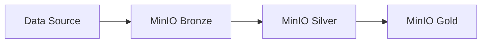

---

# 18. Data Warehouse

PostgreSQL:

```text
PostgreSQL
│
├── raw
├── staging
├── intermediate
└── mart
```

ตัวอย่าง:

```sql
CREATE SCHEMA IF NOT EXISTS raw;

CREATE SCHEMA IF NOT EXISTS staging;

CREATE SCHEMA IF NOT EXISTS mart;
```

---

# 19. Data Lineage

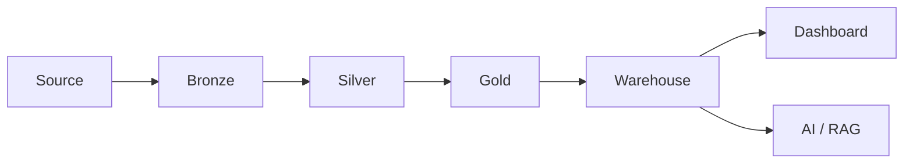

สามารถติดตาม:

```text
Source
 ↓
Transformation
 ↓
Dataset
 ↓
Warehouse
 ↓
Dashboard / AI
```

---

# 20. Monitoring

Monitoring ควรเก็บ:

```text
Pipeline Status
Task Duration
Records Processed
Records Failed
Data Freshness
Quality Score
Error Rate
Retry Count
```

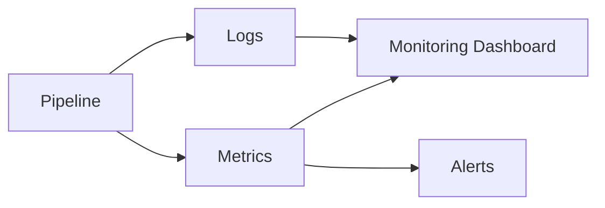

---

# 21. Technology Stack

| Layer                  | Technology                     |
| ---------------------- | ------------------------------ |
| Language               | Python                         |
| Query                  | SQL                            |
| Container              | Docker                         |
| Orchestration          | Apache Airflow                 |
| Transformation         | dbt                            |
| Data Lake              | MinIO                          |
| Warehouse              | PostgreSQL                     |
| Processing             | Pandas / Polars                |
| Distributed Processing | Apache Spark                   |
| Quality                | dbt Tests / Great Expectations |
| Lineage                | OpenLineage                    |
| Catalog                | DataHub                        |
| Monitoring             | Prometheus / Grafana           |
| Version Control        | Git                            |
| CI/CD                  | GitHub Actions                 |

---

# 22. Project Structure

```text
data-engineering-workflow/
│
├── dags/
├── ingestion/
├── transformation/
├── quality/
├── warehouse/
│
├── dbt/
│   ├── models/
│   │   ├── staging/
│   │   ├── intermediate/
│   │   └── marts/
│   ├── tests/
│   └── dbt_project.yml
│
├── data/
│   ├── bronze/
│   ├── silver/
│   └── gold/
│
├── monitoring/
├── tests/
├── notebooks/
├── scripts/
├── docs/
│
├── docker/
├── .github/
│   └── workflows/
│
├── docker-compose.yml
├── requirements.txt
├── .env.example
├── .gitignore
├── README.md
└── LICENSE
```

---

# 23. Data Model

ตัวอย่าง Sales Data Warehouse:

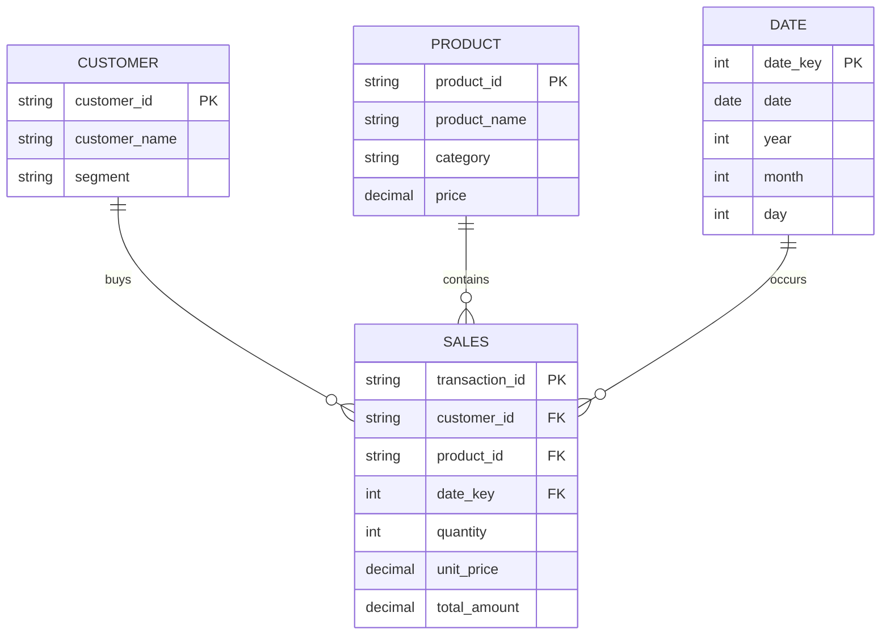

---

# 24. AI / RAG Integration

Data Engineering Platform สามารถเป็นฐานข้อมูลสำหรับ AI:

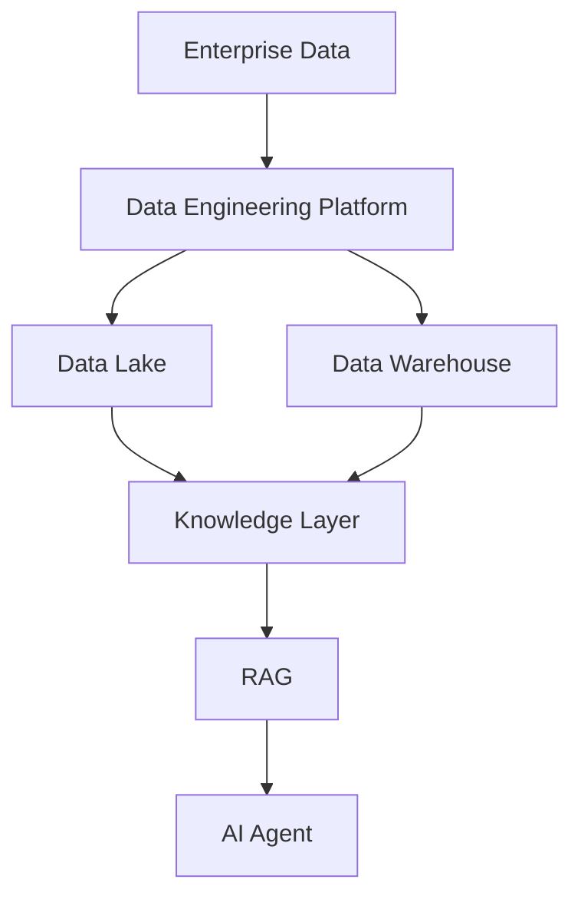

รองรับ:

* Knowledge Base
* RAG
* Embedding Pipeline
* Vector Search
* AI Agent
* Document Processing
* Retrieval Evaluation

---

# 25. Distributed Processing

เมื่อข้อมูลมีขนาดใหญ่ สามารถเพิ่ม Apache Spark:

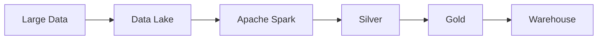

แนวทางเลือก Processing Engine:

```text
Small Data
    ↓
Python / Pandas

Medium Data
    ↓
Polars / SQL

Large Data
    ↓
Apache Spark
```

---

# 26. Development Roadmap

```text
Phase 01
Foundation
    ↓
Phase 02
Data Ingestion
    ↓
Phase 03
Data Lake
    ↓
Phase 04
ETL / ELT
    ↓
Phase 05
Airflow
    ↓
Phase 06
dbt
    ↓
Phase 07
Data Quality
    ↓
Phase 08
Data Warehouse
    ↓
Phase 09
Data Lineage
    ↓
Phase 10
Data Catalog
    ↓
Phase 11
Monitoring
    ↓
Phase 12
CI/CD
    ↓
Phase 13
Spark
    ↓
Phase 14
Production
    ↓
Phase 15
AI / RAG / Agent
```

---

# 27. Production Architecture

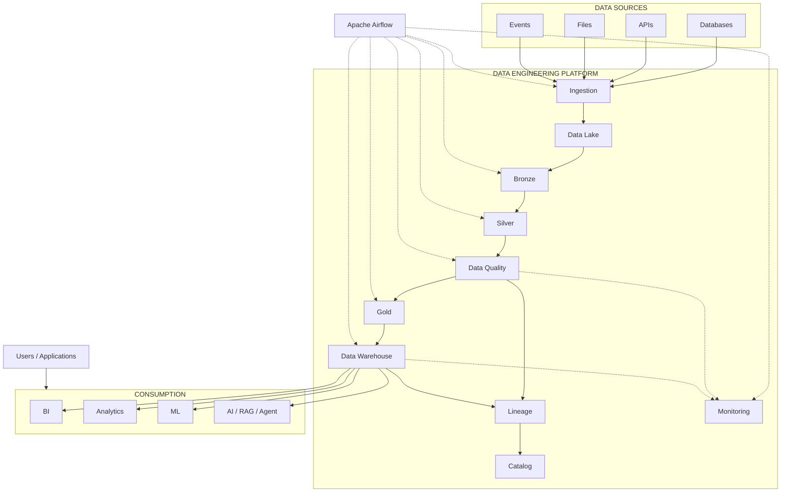

---

# 28. Production Checklist

## Infrastructure

* [ ] Docker
* [ ] PostgreSQL
* [ ] MinIO
* [ ] Airflow

## Pipeline

* [ ] Ingestion
* [ ] Bronze
* [ ] Silver
* [ ] Gold
* [ ] Warehouse

## Quality

* [ ] Schema Validation
* [ ] NULL Check
* [ ] Duplicate Check
* [ ] Business Rules
* [ ] Freshness

## Operations

* [ ] Scheduling
* [ ] Retry
* [ ] Logging
* [ ] Monitoring
* [ ] Alerting

## Governance

* [ ] Data Lineage
* [ ] Data Catalog
* [ ] Metadata
* [ ] Data Ownership

## Engineering

* [ ] Git
* [ ] Tests
* [ ] CI/CD
* [ ] Docker
* [ ] Documentation

## Advanced

* [ ] Spark
* [ ] Distributed Processing
* [ ] ML Pipeline
* [ ] RAG
* [ ] AI Agent

---

# 29. Final Vision

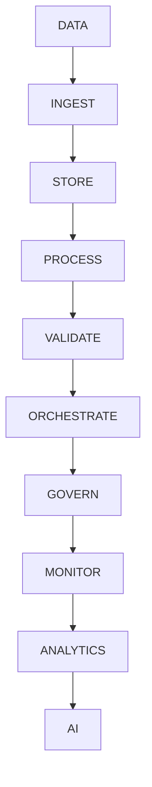

**Vision:**

> **Build → Automate → Validate → Observe → Govern → Scale → AI**

Data Engineering Workflow Platform ถูกออกแบบให้เริ่มจาก Pipeline ขนาดเล็กบนเครื่อง Local ได้ทันที และสามารถขยายไปสู่ Data Platform, Distributed Processing และ AI Data Infrastructure ได้ในอนาคต.

---

# 30. License

This project is licensed under the MIT License - see the [LICENSE](LICENSE) file for details.

```
MIT License

Copyright (c) 2026 Data Engineering Workflow Platform

Permission is hereby granted, free of charge, to any person obtaining a copy
of this software and associated documentation files (the "Software"), to deal
in the Software without restriction, including without limitation the rights
to use, copy, modify, merge, publish, distribute, sublicense, and/or sell
copies of the Software, and to permit persons to whom the Software is
furnished to do so, subject to the following conditions:

The above copyright notice and this permission notice shall be included in all
copies or substantial portions of the Software.

THE SOFTWARE IS PROVIDED "AS IS", WITHOUT WARRANTY OF ANY KIND, EXPRESS OR
IMPLIED, INCLUDING BUT NOT LIMITED TO THE WARRANTIES OF MERCHANTABILITY,
FITNESS FOR A PARTICULAR PURPOSE AND NONINFRINGEMENT. IN NO EVENT SHALL THE
AUTHORS OR COPYRIGHT HOLDERS BE LIABLE FOR ANY CLAIM, DAMAGES OR OTHER
LIABILITY, WHETHER IN AN ACTION OF CONTRACT, TORT OR OTHERWISE, ARISING FROM,
OUT OF OR IN CONNECTION WITH THE SOFTWARE OR THE USE OR OTHER DEALINGS IN THE
SOFTWARE.
```
