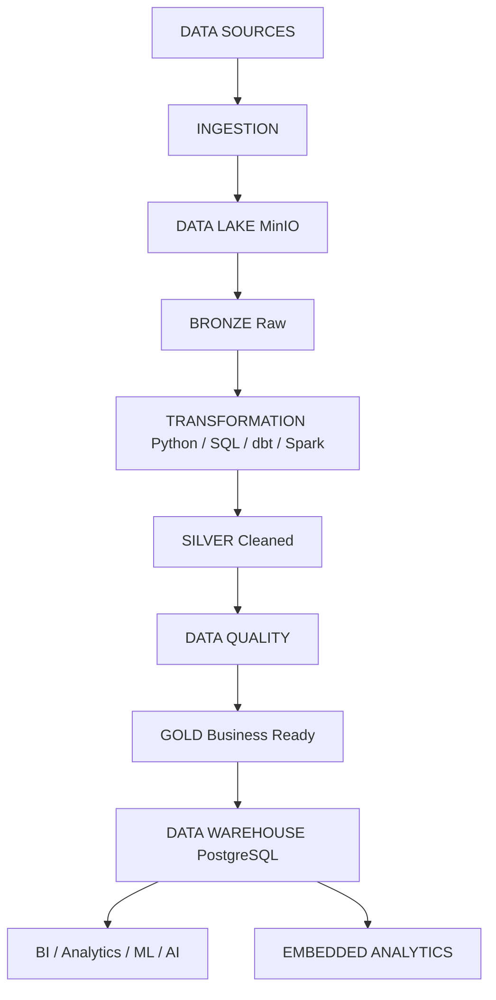
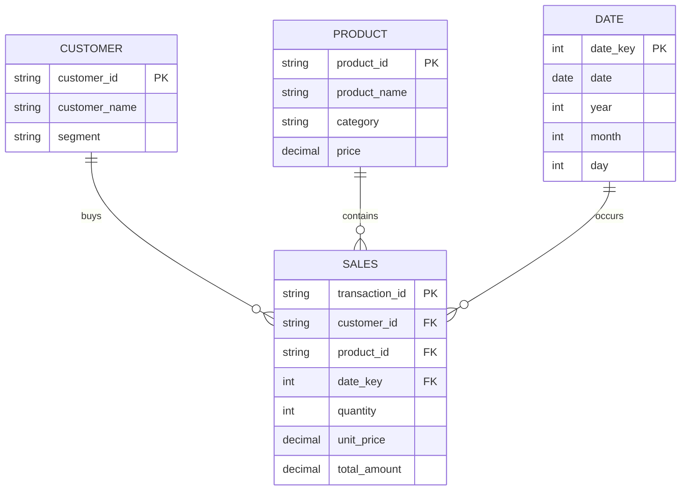
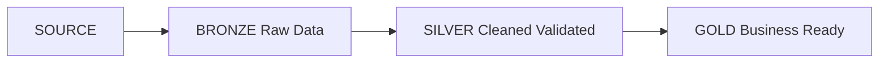
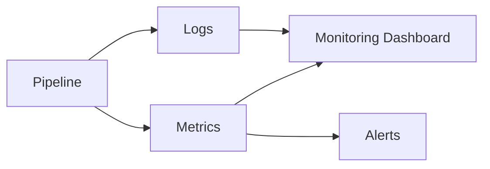

# Data Engineering Workflow Platform


> Open Source Data Engineering Platform สำหรับสร้างและจัดการ Data Pipeline ตั้งแต่ Data Source → Data Lake → Transformation → Data Quality → Data Warehouse → Analytics → AI

---

## 1. Project Name

**Data Engineering Workflow Platform (DEWP)**

---

## 2. Project Description

DEWP เป็นแพลตฟอร์ม Data Engineering แบบเปิดซอร์สที่ช่วยให้ผู้ใช้สร้างและจัดการ Data Pipeline แบบครบวงจร ตั้งแต่การรับข้อมูล (Ingest) ไปยังการส่งข้อมูลให้กับ BI, ML และ AI โดยใช้ Medallion Architecture (Bronze → Silver → Gold) ร่วมกับ Apache Airflow เป็น Workflow Orchestrator

---

## 3. Overview

แนวคิดหลักของแพลตฟอร์ม:

```mermaid
graph TD;
    DATA -> PIPELINE;
    PIPELINE -> QUALITY;
    QUALITY -> WAREHOUSE;
    WAREHOUSE -> ANALYTICS;
    ANALYTICS -> AI;
```

แพลตฟอร์มรองรับขั้นตอนการทำงานแบบต่อเนื่อง:

* **Ingest** — รับข้อมูลจากแหล่งข้อมูลหลากประเภท (CSV, Database, API, Event Streams)
* **Transform** — ทำความสะอาดและแปลงข้อมูลด้วย Python / SQL / dbt
* **Validate** — ตรวจสอบคุณภาพข้อมูลตาม Quality Rules
* **Orchestrate** — จัดการ Pipeline ด้วย Apache Airflow
* **Store** — เก็บข้อมูลใน Data Lake (MinIO) และ Data Warehouse (PostgreSQL)
* **Monitor** — ติดตามสถานะ Pipeline, Metrics และ Alerts ด้วย Prometheus + Grafana
* **Track** — ติดตาม Data Lineage ด้วย OpenLineage และ Apache Atlas
* **Serve** — ส่งข้อมูลต่อให้ BI, ML, AI และ Knowledge Platform

---

## 4. Features

| Feature | Description |
|---|---|
| Medallion Architecture | แบ่งข้อมูลเป็น 3 ชั้น: Bronze (Raw), Silver (Cleaned), Gold (Business Ready) |
| Data Lake | ใช้ MinIO เป็น Object Storage สำหรับเก็บข้อมูล Bronze/Silver/Gold |
| Data Warehouse | ใช้ PostgreSQL พร้อม schema `raw`, `staging`, `mart` |
| ETL Pipeline | Python scripts สำหรับ Extraction, Validation, Transformation, Loading |
| dbt Integration | SQL Transformation แบบ Staging → Intermediate → Mart |
| Workflow Orchestration | Apache Airflow (CeleryExecutor) สำหรับการกำหนด Schedule และ Task Dependencies |
| Data Quality | Automated quality checks (duplicates, nulls, ranges, business rules) |
| Distributed Processing | Apache Spark (master + worker) สำหรับข้อมูลขนาดใหญ่ |
| Monitoring | Prometheus (metrics) + Grafana (dashboards) |
| Data Lineage | OpenLineage integration ผ่าน Airflow plugin และ Apache Atlas metadata catalog |
| AI / RAG | Knowledge Platform สำหรับ AI Agent และ Vector Search |
| Embedded Analytics | REST API + JavaScript SDK สำหรับ embed dashboards/charts ในแอปภายนอก |

---

## 5. System Requirements

### ความต้องการซอฟต์แวร์

* **Git** — version control
* **Python** — 3.13+
* **Docker** — container runtime
* **Docker Compose** — multi-container orchestration

### ความต้องการฮาร์ดแวร์ (แนะนำ)

* RAM อย่างน้อย 8 GB (ขอแนะนำ 16 GB)
* CPU อย่างน้อย 4 cores
* ดิสก์อย่างน้อย 20 GB ว่าง

---

## 6. Technology Stack

| Layer | Technology |
|---|---|
| Language | Python 3.13 |
| Query | SQL |
| Container | Docker |
| Orchestration | Apache Airflow 3.3 (CeleryExecutor) |
| Transformation | dbt |
| Data Lake | MinIO |
| Warehouse | PostgreSQL 16 |
| Processing | Pandas / Polars |
| Distributed Processing | Apache Spark 3.5 |
| Quality | Python SQL checks |
| Lineage | OpenLineage |
| Catalog | Apache Atlas |
| Monitoring | Prometheus / Grafana |
| Embedded Analytics | FastAPI / Chart.js / JavaScript SDK |
| Version Control | Git |
| CI/CD | GitHub Actions |

---

## 7. Architecture

```text
Data Sources
      ↓
   Ingestion
      ↓
   Data Lake
      ↓
    Bronze
      ↓
Transformation
      ↓
    Silver
      ↓
 Data Quality
      ↓
     Gold
      ↓
Data Warehouse
      ↓
BI / Analytics / ML / AI
```



---

## 8. Project Structure

```text
data-engineering-platform/
│
├── dags/
│   ├── data_platform_pipeline.py
│   ├── hello_pipeline.py
│   └── sales_etl.py
│
├── ingestion/
│   ├── sales_pipeline.py
│   ├── sales_pipeline_minio.py
│   └── minio_client.py
│
├── transformation/
│   ├── sales_silver.py
│   └── sales_silver_minio.py
│
├── quality/
│   ├── sales_quality.py
│   └── gold_quality.py
│
├── warehouse/
│
├── sql/
│   ├── init_schema.sql
│   ├── staging/
│   │   └── sales.sql
│   ├── marts/
│   │   └── sales.sql
│   └── gold_sales.sql
│
├── dbt/
│   └── dbt_project.yml
│
├── analytics/
│   └── dbt_project.yml
│
├── data/
│   ├── raw/
│   │   └── sales.csv
│   ├── bronze/
│   │   └── sales/
│   ├── silver/
│   │   └── sales/
│   └── gold/
│
├── monitoring/
│   ├── prometheus.yml
│   └── grafana/
│       ├── dashboards/
│       └── datasources/
│
├── ui/
│   └── src/
│       └── entities/
│
├── backend/
│   ├── app/                # FastAPI API, SaaS, auth, billing
│   ├── config.py
│   └── database.py
├── frontend/               # Next.js SaaS web application
├── workers/                # Knowledge Platform background worker
├── docker/                 # Knowledge Platform container images and SQL
├── scripts/                # Setup and operational scripts
│
├── embedded/
│   ├── main.py
│   ├── config.py
│   ├── database.py
│   ├── models.py
│   ├── seed.py
│   ├── requirements.txt
│   └── sdk/
│       ├── embedded-analytics.js
│       ├── embedded-analytics.d.ts
│       ├── package.json
│       └── demo.html
│
├── mobile/
│
├── tests/
├── notebooks/
├── scripts/
├── docs/
│
├── config/
├── logs/
│
├── docker/
├── .github/
│   └── workflows/
│
├── docker-compose.yaml
├── docker-compose.yml
├── requirements.txt
├── .env
├── .env.example
├── .gitignore
├── LICENSE
├── README.md
├── README.pdf
└── despk-m.png
```

---

## 9. Installation

### 9.1 Clone Repository

```bash
git clone https://github.com/MaaeYeng2517/data-engineering-platform.git
cd data-engineering-platform
```

### 9.2 ติดตั้งเครื่องมือพื้นฐาน

```bash
brew install git python uv
brew install --cask docker
```

ตรวจสอบเวอร์ชัน:

```bash
git --version
python3 --version
uv --version
docker --version
docker compose version
```

### 9.3 สร้าง Python Environment

```bash
uv venv --python 3.13
source .venv/bin/activate
```

### 9.4 ติดตั้ง Python Packages

```bash
uv pip install -r requirements.txt
```

---

## 10. Configuration

### 10.1 Environment File

สร้างไฟล์ `.env` จากตัวอย่าง:

```bash
cp .env.example .env
```

แก้ไขค่าใน `.env`:

```env
AIRFLOW_UID=501
SPARK_MASTER=spark://spark-master:7077
SPARK_EXECUTOR_MEMORY=2g
SPARK_EXECUTOR_CORES=2
SPARK_NUM_EXECUTORS=2
SPARK_DRIVER_MEMORY=1g
FERNET_KEY=your-fernet-key-here
AIRFLOW__API_AUTH__JWT_SECRET=airflow_jwt_secret
```

### 10.2 Docker Compose

เริ่มต้นโครงสร้างระบบ:

```bash
docker compose up -d

# เปิด Apache Atlas และ seed metadata ตัวอย่าง
docker compose --profile atlas up -d atlas atlas-init
```

ตรวจสอบสถานะคอนเทนเจอร์:

```bash
docker compose ps
```

หยุดระบบ:

```bash
docker compose down
```

### 10.3 Knowledge Platform SaaS

Knowledge Platform ถูกย้ายมารวมกับโปรเจกต์หลักแล้ว ใช้ source ที่ root:

```bash
# Backend
uvicorn backend.main:app --host 0.0.0.0 --port 8000 --reload

# Frontend
cd frontend
npm install
npm run dev
```

เปิดใช้งานหน้าเว็บที่ `http://localhost:3000` และ API documentation ที่ `http://localhost:8000/docs` ระบบรองรับ registration, member/admin RBAC, Stripe Checkout/Portal, API key generation และ API key authentication.

---

## 11. Environment Variables

| Variable | Default | Description |
|---|---|---|
| `AIRFLOW_UID` | `50000` | User ID ใน Airflow containers |
| `AIRFLOW_IMAGE_NAME` | `apache/airflow:3.3.2` | Docker image ของ Airflow |
| `AIRFLOW_PROJ_DIR` | `.` | Base path สำหรับ volume mounts |
| `FERNET_KEY` | - | กุญแจเข้ารหัสสำหรบ Airflow |
| `MINIO_ENDPOINT` | `localhost:9000` | MinIO endpoint |
| `MINIO_ACCESS_KEY` | `minioadmin` | MinIO access key |
| `MINIO_SECRET_KEY` | `minioadmin` | MinIO secret key |
| `MINIO_SECURE` | `false` | ใช้ HTTPS หรือไม่ |
| `ATLAS_ENDPOINT` | `http://localhost:21000` | Apache Atlas API endpoint |
| `ATLAS_USERNAME` | `admin` | Apache Atlas UI/API username |
| `ATLAS_PASSWORD` | `admin` | Apache Atlas UI/API password |
| `DB_HOST` | `postgres` | PostgreSQL host |
| `PGPASSWORD` | `dataeng` | PostgreSQL password |
| `SPARK_MASTER` | `spark://spark-master:7077` | Spark master URL |
| `EMBED_TOKEN_SECRET` | `change-me-in-production` | Secret key สำหรับ embed token signing |
| `EMBED_BASE_URL` | `http://localhost:8080` | Base URL สำหรับ embed URLs |
| `ALLOWED_ORIGINS` | `["*"]` | Allowed CORS origins สำหรับ embedded analytics |

---

## 12. Usage

### 12.1 เริ่มต้น Infrastructure

```bash
docker compose up -d
```

### 12.2 สร้าง Sample Data

สร้างไฟล์ `data/raw/sales.csv`:

```csv
transaction_id,transaction_date,customer_id,product_id,quantity,unit_price
TX001,2026-09-01,C001,P001,2,100.00
TX002,2026-09-01,C002,P002,1,250.00
TX003,2026-09-02,C001,P003,3,150.00
TX004,2026-09-02,C003,P001,5,100.00
TX005,2026-09-03,C004,P002,2,250.00
TX006,2026-09-03,C002,P003,1,150.00
```

### 12.3 รัน Transformation

```bash
python transformation/sales_silver.py
```

ผลลัพธ์:

```text
data/
│
├── bronze/
│   └── sales/sales.csv
│
├── silver/
│   └── sales/sales_clean.csv
│
└── gold/
    └── sales_daily.csv
```

### 12.4 ตรวจสอบผลลัพธ์

```bash
cat data/silver/sales/sales_clean.csv
cat data/gold/sales_daily.csv
```

ผลลัพธ์ Gold:

```text
transaction_date,transaction_count,units_sold,revenue
2026-09-01,2,3,450
2026-09-02,2,8,750
2026-09-03,2,3,650
```

### 12.5 เข้า PostgreSQL

```bash
docker exec -it de-postgres \
psql -U dataeng -d datawarehouse
```

ตรวจสอบ Schema และ Tables:

```sql
\dn
\dt raw.*
\dt staging.*
\dt mart.*
```

---

## 13. API Documentation

### 13.1 Airflow API

* **URL:** `http://localhost:8080`
* **Username:** `airflow`
* **Password:** `airflow`

### 13.2 MinIO API

* **Console URL:** `http://localhost:9001`
* **API URL:** `http://localhost:9000`
* **Access Key:** `minioadmin`
* **Secret Key:** `minioadmin`

### 13.3 PostgreSQL

* **Host:** `localhost:5432`
* **Database:** `datawarehouse`
* **User:** `dataeng`
* **Password:** `dataeng`

### 13.4 Grafana

* **URL:** `http://localhost:3000`
* **Username:** `admin`
* **Password:** `admin`

### 13.5 Apache Atlas

* **URL:** `http://localhost:21000`
* **Username:** `admin`
* **Password:** `admin`
* **Seed entities:** `atlas-init` creates the `raw`, `raw.sales`, and sales column metadata after Atlas is healthy

### 13.6 Prometheus

* **URL:** `http://localhost:9090`

---

## 13.7 Embedded Analytics API

* **URL:** `http://localhost:8080`
* **API Docs:** `http://localhost:8080/docs`

---

## 13.8 Embedded Analytics Usage

### 13.8.1 เริ่มต้น Embedded Analytics Service

```bash
docker compose up -d embedded
```

### 13.8.2 สร้าง Sample Dashboards และ Charts

```bash
python embedded/seed.py
```

### 13.8.3 ใช้งานผ่าน JavaScript SDK

ติดตั้ง SDK:

```bash
npm install @dewp/embedded-sdk
```

หรือใช้ผ่าน CDN:

```html
<script src="https://cdn.jsdelivr.net/gh/MaaeYeng2517/data-engineering-platform@main/embedded/sdk/embedded-analytics.js"></script>
```

ตัวอย่างการใช้งาน:

```javascript
// Initialize SDK
const analytics = new DEWPEmbeddedAnalytics({
  apiBase: 'http://localhost:8080'
});

// สร้าง embed token สำหรับ dashboard
const token = await analytics.createToken({ 
  dashboardId: 'sales-overview',
  expiresIn: 3600  // 1 ชั่วโมง
});

// Embed dashboard ใน container
analytics.embedDashboard({
  container: 'dashboard-container',
  embedUrl: token.embedUrl,
  onLoad: () => console.log('Dashboard loaded!'),
  onError: (err) => console.error('Failed to load:', err)
});

// Embed chart เดี่ยว
const chartToken = await analytics.createToken({ 
  chartId: 'daily-revenue' 
});

analytics.embedChart({
  container: 'chart-container',
  embedUrl: chartToken.embedUrl,
});
```

### 13.7.4 Embed ผ่าน iframe โดยตรง

```html
<iframe 
  src="http://localhost:8080/embed/dashboard/sales-overview?token=YOUR_EMBED_TOKEN"
  width="100%" 
  height="600px"
  frameborder="0"
  allowfullscreen>
</iframe>

<iframe 
  src="http://localhost:8080/embed/chart/daily-revenue?token=YOUR_EMBED_TOKEN"
  width="100%" 
  height="400px"
  frameborder="0"
  allowfullscreen>
</iframe>
```

### 13.7.5 API Endpoints

| Method | Endpoint | Description |
|---|---|---|
| `POST` | `/api/v1/embed/tokens` | สร้าง embed token |
| `GET` | `/api/v1/embed/dashboards` | รายการ dashboards ทั้งหมด |
| `GET` | `/api/v1/embed/dashboards/{id}` | รายละเอียด dashboard |
| `GET` | `/api/v1/embed/charts` | รายการ charts ทั้งหมด |
| `GET` | `/api/v1/embed/charts/{id}` | รายละเอียด chart |
| `GET` | `/api/v1/embed/charts/{id}/data` | ข้อมูล chart (ต้องใช้ token) |
| `GET` | `/embed/dashboard/{id}` | Embed dashboard HTML page |
| `GET` | `/embed/chart/{id}` | Embed chart HTML page |

### 13.7.6 Security Features

* **Token-based Authentication**: ทุก embed request ต้องใช้ token
* **Token Expiry**: Token มีอายุการใช้งาน (default 1 ชั่วโมง)
* **Domain Restriction**: จำกัด domain ที่สามารถ embed ได้
* **CORS Support**: รองรับ CORS สำหรับ cross-origin embedding

---

## 14. Database

### 14.1 PostgreSQL — Data Warehouse

| Database | User | Password | Purpose |
|---|---|---|---|
| `airflow` | `airflow` | `airflow` | Airflow metadata |
| `datawarehouse` | `dataeng` | `dataeng` | Data warehouse |

### 14.2 Schemas

```sql
CREATE SCHEMA IF NOT EXISTS raw;
CREATE SCHEMA IF NOT EXISTS staging;
CREATE SCHEMA IF NOT EXISTS mart;
```

### 14.3 MinIO — Data Lake

| Bucket | Description |
|---|---|
| `bronze` | Raw data (immutable copy from source) |
| `silver` | Cleaned, validated, deduplicated data |
| `gold` | Business-ready aggregated data |

---

## 15. Data Model

### 15.1 Sales Data Warehouse Entity-Relationship



### 15.2 Bronze / Silver / Gold Layers



**Bronze** — Raw: Original, Immutable, Traceable
**Silver** — Cleaned: Standardization, Deduplication, Validation
**Gold** — Business Ready: Analytics, Reporting, BI, ML, AI

---

## 16. Testing

### 16.1 รัน Tests

```bash
pytest tests/ -v
```

### 16.2 Test Coverage

```bash
pytest tests/ --cov=src/ --cov-report=html
```

### 16.3 ประเภท Tests

| Type | Description |
|---|---|
| Unit Tests | ทดสอบฟังก์ชันแยกจากกัน |
| Integration Tests | ทดสอบการทำงานระหว่าี้ของ Pipeline |
| Data Quality Tests | ทดสอบ Quality Rules บนข้อมูล |
| dbt Tests | ทดสอบโมเดล dbt (schema tests, data tests) |

---

## 17. Code Quality

### 17.1 Linting (Ruff)

```bash
ruff check .
```

### 17.2 แก้ไข Lint Issues

```bash
ruff check . --fix
```

### 17.3 Formatting

```bash
ruff format .
```

---

## 18. Security

* ใช้ `.env` สำหรับเก็บ secrets — ไม่ commit `.env` ไปยัง Git
* ตั้งค่า `.gitignore` เพื่อป้องกันการ commit ไฟล์สำคัญ
* ใช้ `FERNET_KEY` สำหรับการเข้ารหัส Airflow
* ใช้ `MINIO_SECURE` เป็น `true` ใน production
* ไม่ใช้ค่า default ของ credentials ใน production

### 18.1 Security Headers

```env
AIRFLOW__API_AUTH__JWT_SECRET=your-secure-jwt-secret
FERNET_KEY=your-secure-fernet-key
```

---

## 19. Deployment

### 19.1 Production Deployment Checklist

* ใช้ custom Airflow image แทนการติดตั้ง packages แบบ runtime
* ตั้งค่า environment variables ผ่าน secret manager
* เปิดใช้งาน SSL/TLS สำหรับทุก service
* ตั้งค่า backup strategy สำหรับ PostgreSQL และ MinIO
* ใช้ external PostgreSQL และ Redis แทนค่า default

### 19.2 CI/CD

GitHub Actions workflow อัตโนมัติ:

```text
.git/
└── workflows/
    └── ci.yml   → รัน tests, lint, type check
    └── cd.yml   →  deploy ไปยัง production (on release)
```

---

## 20. Monitoring & Logging

### 20.1 สิ่งที่ Monitor

```text
Pipeline Status
Task Duration
Records Processed
Records Failed
Data Freshness
Quality Score
Error Rate
Retry Count
```

### 20.2 สถาปัตยกรรม



### 20.3 Prometheus Targets

| Job | Target |
|---|---|
| `prometheus` | `localhost:9090` |
| `airflow` | `airflow-apiserver:8080` |
| `postgres` | `datawarehouse:5432` |
| `minio` | `minio:9000` |
| `spark-master` | `spark-master:8080` |

---

## 21. Troubleshooting

### 21.1 Docker Compose ไม่เริ่ม

* ตรวจสอบว่า Docker Desktop ทำงานอยู่
* ตรวจสอบว่ามีพอ RAM (แนะนำ 8 GB+)
* ลองรัน `docker compose down -v` แล้ว `docker compose up -d` ใหม่

### 21.2 Airflow เข้าไม่ได้

* ตรวจสอบว่า `AIRFLOW_UID` ถูกตั้งค่าใน `.env`
* ตรวจสอบ `docker compose logs airflow-apiserver`

### 21.3 PostgreSQL connection failed

* ตรวจสอบว่า container `datawarehouse` ทำงานอยู่ (`docker compose ps`)
* ตรวจสอบ credentials ใน `.env`

### 21.4 MinIO เข้าไม่ได้

* ตรวจสอบว่า container `minio` ทำงานอยู่
* ใช้ `minioadmin` / `minioadmin` เป็น default credentials

---

## 22. Development Guide

### 22.1 การพัฒนา Pipeline ใหม่

1. สร้างไฟล์ Python ใน `transformation/` หรือ `ingestion/`
2. เขียน DAG ใน `dags/`
3. สร้าง SQL script ใน `sql/` (เช่น `sql/staging/`, `sql/marts/`)
4. ทดสอบ pipeline ด้วย `python <script>.py`
5. ตรวจสอบผลลัพธ์ใน PostgreSQL และ MinIO

### 22.2 การพัฒนา dbt Model

1. สร้างไฟล์ SQL ใน `dbt/models/`
2. กำหนด materialization ใน `dbt_project.yml`
3. รัน `dbt debug` → `dbt run` → `dbt test`

### 22.3 Git Workflow

```bash
git checkout -b feature/new-pipeline
# ... ทำการพัฒนา ...
git add .
git commit -m "Add new pipeline"
git push origin feature/new-pipeline
```

---

## 23. Versioning

โปรเจกต์ใช้ Semantic Versioning ([Semantic Versioning 2.0.0](https://semver.org/)):

```text
MAJOR.MINOR.PATCH
```

* **MAJOR** — การเปลี่ยนแปลงที่ละลาย (breaking changes)
* **MINOR** — ฟีเจอร์ใหม่ (backward compatible)
* **PATCH** — แก้ไขบั๊ค (backward compatible)

---

## 24. Changelog

### v1.0.0 (2026-09-22)

* Initial release — Bronze/Silver/Gold pipeline
* Apache Airflow orchestration (CeleryExecutor)
* MinIO Data Lake integration
* PostgreSQL Data Warehouse
* Data Quality checks
* Prometheus + Grafana monitoring

---

## 25. Roadmap

```text
Phase 01  Foundation          ✓
Phase 02  Data Ingestion      ✓
Phase 03  Data Lake           ✓
Phase 04  ETL / ELT           ✓
Phase 05  Airflow             ✓
Phase 06  dbt                 ✓
Phase 07  Data Quality        ✓
Phase 08  Data Warehouse      ✓
Phase 09  Data Lineage        ✓
Phase 10  Data Catalog        ✓
Phase 11  Monitoring          ✓
Phase 12  CI/CD               ✓
Phase 13  Spark               ✓
Phase 14  Production         🚧
Phase 15  AI / RAG / Agent   🚧
```

---

## 26. Contributing

1. Fork repository
2. สร้าง feature branch (`git checkout -b feature/amazing-feature`)
3. Commit การเปลี่ยนแปลง (`git commit -m 'Add: description'`)
4. Push ไปยัง branch (`git push origin feature/amazing-feature`)
5. เปิด Pull Request

### 26.1 Development Setup

```bash
git clone https://github.com/MaaeYeng2517/data-engineering-platform.git
cd data-engineering-platform
uv venv --python 3.13
source .venv/bin/activate
uv pip install -r requirements.txt
```

---

## 27. Code of Conduct

* ใช้ภาษาที่เป็นสันติภาพและมื่นยืนยาง
* ให้เกียรย์ภูมิคุณและมุมมองที่แตกต่าง
* ไม่ยอมรับการพฤษฐภาคาร, ความหยาบคาย์ หรือการยั่วลงทะเมิง
* ให้ข้อเสนอและข้อวิจารณ์อย่างสร้างสรรค์

---

## 28. Security Policy

### 28.1 Vulnerability Reporting

หากพบ security vulnerability โปรดรายงานผ่านทาง [GitHub Security Advisory](https://github.com/MaaeYeng2517/data-engineering-platform/security/advisories)

หรือส่งอีเมลถึง maintainers (ดูส่วน *Maintainers*)

### 28.2 Supported Versions

| Version | Supported |
|---|---|
| v1.0.x | ✅ |

---

## 29. License

This project is licensed under the MIT License — see the [LICENSE](LICENSE) file for details.

```
MIT License

Copyright (c) 2026 Data Engineering Workflow Platform

Permission is hereby granted, free of charge, to any person obtaining a copy
of this software and associated documentation files (the "Software"), to deal
in the Software without restriction, including without limitation the rights
to use, copy, modify, merge, publish, distribute, sublicense, and/or sell
copies of the Software, and to permit persons to whom the Software is
furnished to do so, subject to the following conditions:

The above copyright notice and this permission notice shall be included in all
copies or substantial portions of the Software.

THE SOFTWARE IS PROVIDED "AS IS", WITHOUT WARRANTY OF ANY KIND, EXPRESS OR
IMPLIED, INCLUDING BUT NOT LIMITED TO THE WARRANTIES OF MERCHANTABILITY,
FITNESS FOR A PARTICULAR PURPOSE AND NONINFRINGEMENT. IN NO EVENT SHALL THE
AUTHORS OR COPYRIGHT HOLDERS BE LIABLE FOR ANY CLAIM, DAMAGES OR OTHER
LIABILITY, WHETHER IN AN ACTION OF CONTRACT, TORT OR OTHERWISE, ARISING FROM,
OUT OF OR IN CONNECTION WITH THE SOFTWARE OR THE USE OR OTHER DEALINGS IN THE
SOFTWARE.
```

---

## 30. Documentation

* [README.md](README.md) — เริ่มต้นและคู่มือการใช้งาน (ไฟล์นี้)
* [README.pdf](README.pdf) — เวอร์ชัน PDF ของ README
* [analytics/README.md](analytics/README.md) — เอกสาร dbt
* [backend/](backend/) — Knowledge Platform API และ SaaS backend
* [mobile/AGENTS.md](mobile/AGENTS.md) — คำแนะนำพัฒนา Mobile App

---

## 31. Maintainers

| Name | GitHub | Description |
|---|---|---|
| MaaeYeng | [@MaaeYeng2517](https://github.com/MaaeYeng2517) | Project Founder & Lead Engineer |

---

## 32. Acknowledgements

* [Apache Airflow](https://airflow.apache.org/) — Workflow Orchestration
* [dbt](https://www.getdbt.com/) — SQL Transformation
* [MinIO](https://min.io/) — Object Storage
* [PostgreSQL](https://www.postgresql.org/) — Data Warehouse
* [Apache Spark](https://spark.apache.org/) — Distributed Processing
* [Prometheus](https://prometheus.io/) — Monitoring
* [Grafana](https://grafana.com/) — Visualization
* [OpenLineage](https://openlineage.io/) — Data Lineage

---

## 33. Contact

* **GitHub Repository:** https://github.com/MaaeYeng2517/data-engineering-platform
* **Issues:** https://github.com/MaaeYeng2517/data-engineering-platform/issues
* **Author:** MaaeYeng ([@MaaeYEng2517](https://github.com/MaaeYEng2517))

---

## 34. Project Status

**Active Development**

โครงสร้างพื้นฐาน (Foundation → Spark) เสร็จสมบูรณ์และทดสอบแล้ว ขณะนี้อยู่ในขั้นตอนการพัฒนา Production Deployment และ AI / RAG Integration
